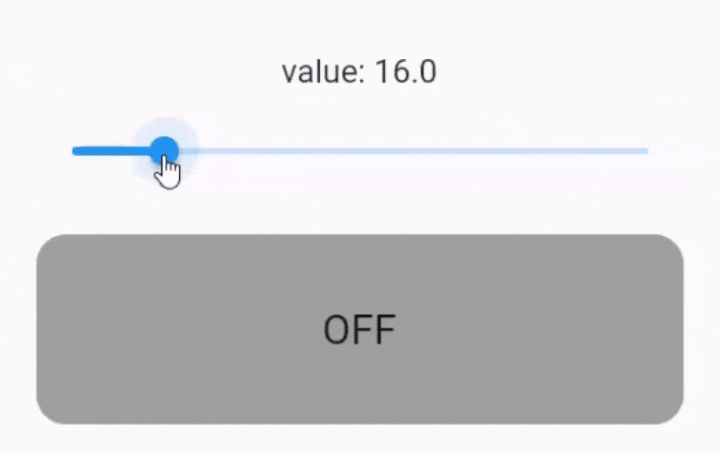

# control_system

Flutter control system widgets, like on-off controller.

## Introduction

A control system manages, commands, directs, or regulates the behavior of other devices or systems using control loops.
It can range from a single home heating controller using a thermostat controlling a domestic boiler to large industrial
control systems which are used for controlling processes or machines.

For more info refer to [Control System on Wikipedia](https://en.wikipedia.org/wiki/Control_system).

## Installation

Add it to your `pubspec.yaml` file:

```yaml
dependencies:
  control_system: ^latest.version
```

Then depend on it:

```dart
import 'package:control_system/control_system.dart';
```

## Controllers

These controllers are provided in this package:

### On-Off Controller

On–off control uses a feedback controller that switches abruptly between two states. A simple bi-metallic domestic
thermostat can be described as an on-off controller. When the temperature in the room (PV) goes below the user setting (
SP), the heater is switched on. Another example is a pressure switch on an air compressor. When the pressure (PV) drops
below the setpoint (SP) the compressor is powered. Refrigerators and vacuum pumps contain similar mechanisms. Simple
on–off control systems like these can be cheap and effective.

For more info refer to [On–Off Controller on Wikipedia](https://en.wikipedia.org/wiki/Bang–bang_control).

`OnOffControllerBuilder` is provided to make an on-off controller widget in Flutter. Refer to dart-docs for more info.

<!--suppress CheckImageSize -->

