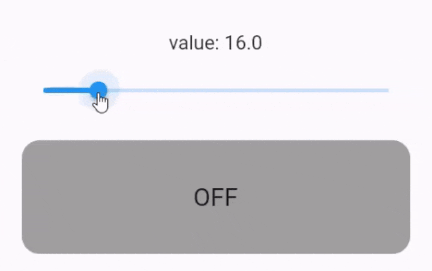

# control_system Examples

Example for `control_system` package.

## on-off controller

```
OnOffControllerBuilder(
  initialState: false, /* initial state of controller */
  value: value, /* provide value here, here it comes from a slide between 0.0 and 100.0 */
  lowerLimit: 40.0, /* lower limit */
  upperLimit: 60.0, /* upper limit */
  listener: (state) { /* listen to changes if needed, here it is not needed */ }
  builder: (context, state) { /* build the resulting widget according to state */ }
);
```

<!--suppress CheckImageSize -->


see complete code [here](lib/on_off_controller.dart).
